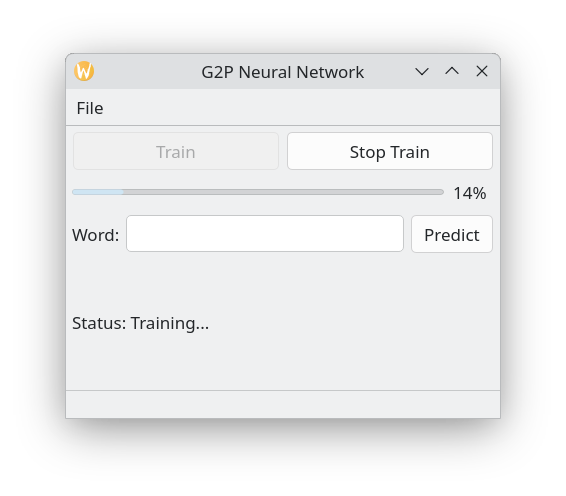

# G2P Neural Network

A custom **Grapheme-to-Phoneme (G2P)** engine written in C++ and Qt. This project uses a neural network to learn how to "pronounce" English words by converting strings of characters (graphemes) into phonetic sounds (phonemes).

The work in this repository explores if it could be possible to replace the G2P engine used in the [Talk  Calendar](https://github.com/crispinprojects/talkcalendar) project with a neural network. Currently Talk Calendar G2P engine uses decision trees with many lines of if/else logic. The idea is to see if the Talk Calendar G2P decision trees (hand-crafted rules for English pronunciation) could be replaced with a trained neural network loading a single file of trained weights and biases that represents the "essence" of English pronunciation. Training uses the Carnegie Mellon University Pronouncing Dictionary (CMUdict).

A screenshot of the G2P Neural Network applcation is shown below.




##  The Approach: Sliding Window + FFNN

Instead of trying to feed an entire word of varying length into a fixed-size network, this project uses a **Sliding Window** technique combined with a **Feed-Forward Neural Network (FFNN)**.

### 1. The Sliding Window

Human speech is contextual. The letter 'c' sounds like /k/ in "cat" but /s/ in "city." To capture this, the network looks at a "window" of 7 characters at a time:

* **3 Letters of Left Context**
* **1 Target Letter** (the one we are predicting for)
* **3 Letters of Right Context**

As the "window" slides across the word, the network predicts the most likely sound for the target letter based on its neighbours.

The sliding window approach was used in early speech synthesis systems such as the [NETtalk]( https://everything.explained.today/NETtalk_(artificial_neural_network)/) project. 

### 2. The Neural Architecture (FFNN)

* **Input Layer:** 189 neurons (7 positions × 27 possible characters).
* **Hidden Layer:** 200 neurons with Sigmoid activation.
* **Output Layer:** 45 neurons (representing the 45 standard English phonemes).
* **Learning:** Backpropagation with **Momentum** to help the network "roll" over local mathematical dips and find the global best solution.

### 3. Training  & Optimization

#### The Training Pipeline

**Diverse Sampling:** The system shuffles the CMUdict to ensure a balanced representation of the entire alphabet (A-Z) in every batch.

**Thread Management:** Utilising QtConcurrent, the  mathematical calculations are decoupled from the Main UI thread, ensuring the application remains responsive during long training runs.

**Persistence:** Weights and biases are serialized to g2p_weights.dat using binary I/O for instant loading in future sessions.
    
#### Optimization: Momentum

To improve training stability and speed, this project implements Momentum (β=0.9) alongside standard Backpropagation.

**Accelerated Convergence:** In areas where the gradient (slope) is consistent, momentum builds up "velocity," allowing the network to reach lower error rates in fewer epochs.

**Escaping Local Minima:** Standard gradient descent can get "stuck" in suboptimal mathematical valleys. Momentum provides numerical inertia, helping the weights escape local minima to find the best global solution.

**Reduced Oscillation:** Language data is inherently noisy. Momentum acts as a filter, smoothing out erratic weight updates and focusing the learning on primary phonetic patterns.

---

## Neural Network Comparison Table

| Type | Description | Best Use Case |
| --- | --- | --- |
| **FFNN** (Feed-Forward) | Data moves in one direction. Simple and fast. Used here with a Sliding Window. | Pattern recognition, basic classification, and "NETtalk" style G2P. |
| **RNN** (Recurrent) | Has "internal loops" that act as a short-term memory of previous inputs. | Time-series data, speech recognition, and processing long sentences. |
| **LSTM** (Long Short-Term) | A smarter RNN that can remember information for long periods of time. | Complex translation and high-end text-to-speech engines. |
| **Transformer** | Uses "Attention" to look at all parts of a sequence simultaneously rather than in order. | State-of-the-art AI like ChatGPT, Google Translate, and modern G2P. |

---

##  The Dataset: CMUdict

In the context of AI and linguistics, a corpus is simply a large, structured collection of text or recorded speech used for statistical analysis or training models. This project utilizes the **Carnegie Mellon University Pronouncing Dictionary (CMUdict)** which is a pronunciation corpus. The dictionary dataset (cmudict-0.7b) can be downloaded from [here](http://www.speech.cs.cmu.edu/cgi-bin/cmudict).

* **What it is:** A free, machine-readable dictionary containing over 134,000 words and their transcriptions.
* **Why it is used:** It provides the "Ground Truth." In AI "Ground Truth"" refers to information that is known to be real or true, obtained through direct observation and measurement, rather than inference. By showing the neural network thousands of examples from this file, in theory it should eventually learn the statistical rules of English pronunciation.
* **Phoneme Set:** It uses the **Arpabet**, which represents sounds using 2-letter codes (e.g., `AE1` for the "a" in "cat").

---

##  Results

Early results for training with 1000 random words from the cmudict file and epochs set to 500 are shown below for the words cat, hello and world.
```
Word = "cat" Predicted phonemes (word sounds) = QList("K", "T")
Word = "hello" Predicted phonemes (word sounds) = QList("?", "EH1", "L", "?")
Word = "world" Predicted phonemes (word sounds) = QList("?", "?", "L", "D")
```
For cat we would expect "K" "AE1"  and "T" and so the phoneme prediction for the middle character based on its neighbors is missing. The "?" indicates an unknown phoneme. However, training with 1000 random words  set show promising results indicating that the sliding window approach for capturing character context appears to be working. With 5000 random words I was able to get better results and so the  number of words used for training is important. I had successes with words "Cat," "World," and "Five" which shows that the network understands simple consonant-vowel-consonant (CVC) structures. However with "birthday" (B ER1 T ? D ? ?) the network struggled with the th digraph and the ending ay. With a 5,000-word dataset, the letter y at the end of a word might only appear a few dozen times and so the neural network needs more "evidence." to predict the phonemes for birthday.  The NETtalk artificial neural network for speech synthesis developed in the 1980s used 20,000 words in its dataset (see weblinks below).

So the next steps are to increase training data count to 10000 and see if results improve and then to 20000. Training can take many hours. This should give the network a much larger "corpus" to learn from, allowing it to see and understand more character combinations. I also need to experiment further with the neural network parameters such as learning rate.

For now the hand-coded decision tree G2P algorithm used with Talk Calendar is better that the sliding window neural network approach described here. With words like "Cat" a specific rule is written to transcribe it. 

In state-of-the-art AI more advanced types of neural networks such as RNNs and Transformers are used for translations and G2P. Transformers (like Gemini or GPT) use sequential memory for context. With transformers instead of reading character-by-character and trying to remember the past, a transformer looks at every character in the sequence simultaneously and uses "attention weights" to decide which other characters are most relevant to the one it is currently processing. This approach is considerably more complex than the sliding window approach used in this project. 


##  How to Compile and Run

### Prerequisites

* **Qt Framework 6.x** (or 5.15+)
* **C++17 Compiler** (GCC, Clang, or MSVC)
* **CMake** (recommended) or **qmake**

### Build Instructions

The project has been developed using Debian Trixie.

1. **Clone/Open:** Open the project file (`.pro` or `CMakeLists.txt`) in **Qt Creator**.
2. **Clean & Rebuild:** Select `Build > Clean All`, then `Build > Run CMake`, followed by `Build > Build Project`.
3. **Data Placement:** Ensure the `cmudict0.7b` file is located in the **Application Output folder** (where the binary is generated).
4. **Run:** Hit the "Run" button in Qt Creator.

### Training the Network

1. Ensure the `cmudict0.7b` file is located in the application output folder.
2. Click **"Train"**. The application will launch a background thread to prevent the UI from freezing.
3. Monitor the **Progress Bar**. Once complete, weights are automatically saved to `g2p_weights.dat`.

---

##  Future Improvements

* **ReLU (Rectified Linear Unit) Activation:** Swapping Sigmoid for ReLU to combat vanishing gradients.
* **Deep Layers:** Adding a second hidden layer to capture more complex linguistic nuances.
* **Shuffle Logic:** Shuffling the 120,000-word dictionary to ensure the network learns the whole alphabet simultaneously.
* Explore the use of **RNNs or Transformers**

---

## Weblinks

[CMUdict Corpus](https://github.com/Alexir/CMUdict/blob/master/cmudict-0.7b)
A working version of cmudict, maintained by Alexander Rudnicky 

[NetTalk](https://en.wikipedia.org/wiki/NETtalk_(artificial_neural_network))
NETtalk artificial neural network developed in the 1980s that learns to pronounce written English text. The program was trained on English words and their corresponding pronunciations. It was able to accurately generate pronunciations for unseen words. 


